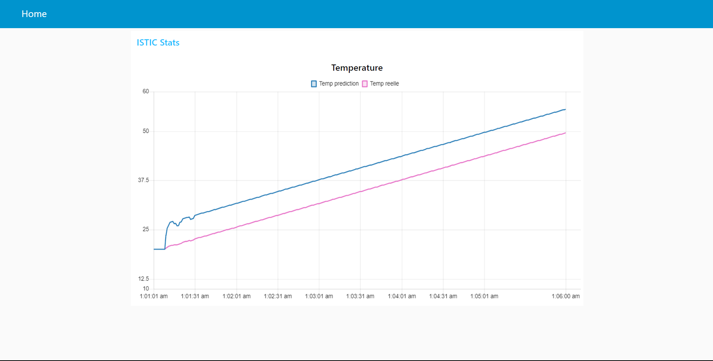

# Node-RED IoT Temperature Prediction Project

Welcome to my Node-RED IoT Temperature Prediction Project repository! 🌐

## About

The Node-RED IoT Temperature Prediction Project is an innovative solution for predicting temperatures based on time-series data. Leveraging Node-RED, this project takes a CSV input of time and temperature, performs regression analysis, and predicts the temperature for the next minute. The results are visualized in a chart on the Node-RED dashboard.

## Features

- **CSV Input Processing:** Upload a CSV file containing time and temperature data to initiate the prediction process.
- **Regression Analysis:** Utilizes machine learning algorithms to perform regression on the input data for temperature prediction.
- **Real-time Visualization:** The predicted temperatures are dynamically displayed in a chart on the Node-RED dashboard.
- **User-friendly Interface:** Built with Node-RED, ensuring an intuitive and user-friendly experience for configuring and visualizing predictions.

## How to Use

Using the Node-RED IoT Temperature Prediction Project is straightforward:

1. Install Node-RED on your system if you haven't already. [Node-RED Installation Guide](https://nodered.org/docs/getting-started/installation)
2. Clone or download this project repository to your local machine.
3. Import the Node-RED flow from the provided JSON file (`iot_temp_regression.json`) into your Node-RED instance.
4. Deploy the Node-RED flow and open the Node-RED dashboard.
5. Choose a CSV file with time and temperature data using the designated file node, or any other input series.
6. Witness real-time temperature predictions displayed on the dashboard chart.

## Contribution

We encourage contributions to enhance the Node-RED IoT Temperature Prediction Project! Here's how you can get involved:

- Fork the repository and make your desired changes.
- Submit a pull request with a detailed explanation of the enhancements you've made.
- Engage in discussions with other contributors to exchange ideas and collaborate on future improvements.

### Technologies Used

- [Node-RED](https://nodered.org/): A flow-based development tool for visual programming.

I appreciate your support. Happy coding! 📈🌐
